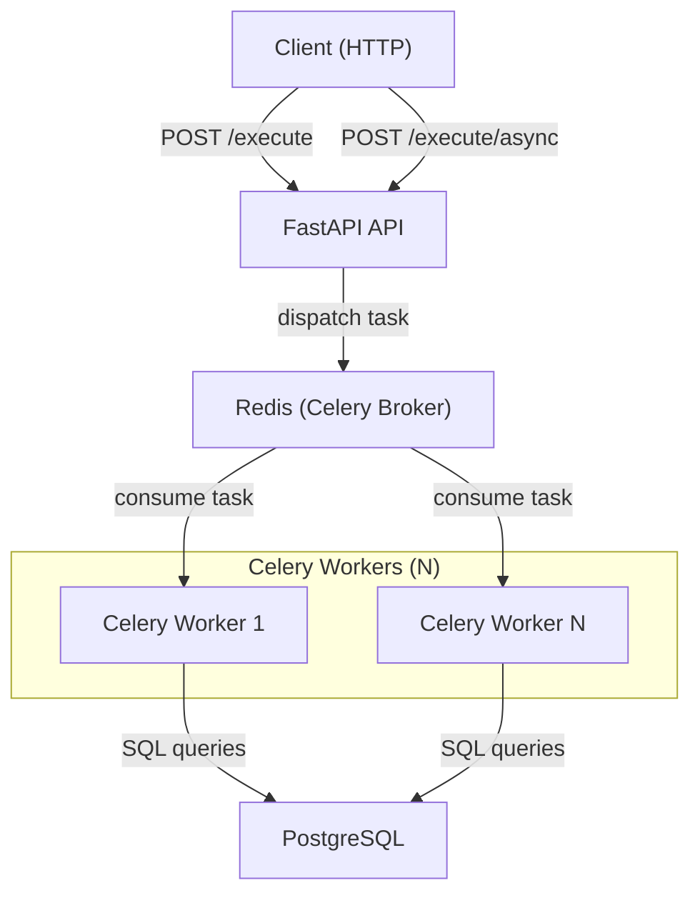

# AP Executor

[](https://img.shields.io/github/license/datagems-eosc/ap-executor)

A FastAPI service that **executes the operators** defined in an Analytical Pattern (AP) step by step against PostgreSQL databases.

Given an AP in PG-JSON format, the service:
1. Parses the operator graph
2. Resolves the execution order (topological sort via `follows` edges)
3. Executes each operator against the target database
4. Returns per-operator results

---

## Architecture



By default, the FastAPI process starts an **embedded Celery worker** in a daemon thread — no separate process required. For production scale-out, additional standalone workers can be launched independently.

---

## Environment Variables

Copy `.env.example` to `.env` and fill in the values.

| Variable | Required | Default | Description |
|---|---|---|---|
| `REDIS_BROKER_URI` | No | `redis://redis:6379/0` | Redis URL used as Celery broker and result backend |
| `USE_EMBEDDED_CELERY_WORKER` | No | `true` | Start a Celery worker inside the FastAPI process |
| `POSTGRES_USER` | Yes | — | PostgreSQL username |
| `POSTGRES_PASSWORD` | Yes | — | PostgreSQL password |
| `POSTGRES_HOST` | Yes | — | Primary PostgreSQL host |
| `POSTGRES_PORT` | No | `5432` | Primary PostgreSQL port |
| `POSTGRES_TIMESCALE_HOST` | No | — | Fallback PostgreSQL host |
| `POSTGRES_TIMESCALE_PORT` | No | `5433` | Fallback PostgreSQL port |
| `ROOT_PATH` | No | `""` | API root path when behind a reverse proxy |

---

## Quick Start

The repository ships a [Dev Container](https://containers.dev/) that provides Python, Redis, and PostgreSQL out of the box.

```bash
# 1. Open in VS Code Dev Container (recommended)
#    → or run locally after installing uv

# 2. Install all dependencies (including dev/test groups)
uv sync --all-groups

# 3. Copy and edit environment variables
cp .env.example .env

# 4. Start the service (embedded Celery worker starts automatically)
uv run ap_executor/main.py
```

The API is then available at `http://localhost:5000`. Interactive docs at `http://localhost:5000/docs`.

### Running a standalone Celery worker

```bash
docker run --rm \
  --env-file .env \
  ap-executor:prod \
  uv run celery -A ap_executor.celery_app:celery_app worker --loglevel=info
```

### Running tests

```bash
pytest tests/
```

Tests use `testcontainers` to spin up a PostgreSQL instance automatically — no manual setup needed.

---

## API Endpoints

| Method | Endpoint | Description |
|---|---|---|
| `POST` | `/api/v1/execute` | Execute an AP synchronously |
| `POST` | `/api/v1/execute/async` | Execute an AP asynchronously (returns `task_id`) |
| `GET`  | `/api/v1/execute/async/{task_id}` | Poll for async execution result |
| `GET`  | `/api/v1/health` | Liveness check |
| `GET`  | `/api/v1/ready` | Readiness check (DB + Redis) |
