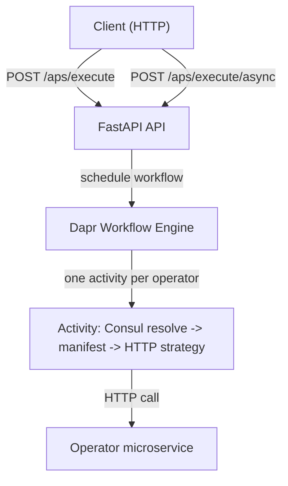

# AP Executor

[](https://img.shields.io/github/license/datagems-eosc/ap-executor)

A FastAPI service that **orchestrates execution of the operators** defined in an Analytical Pattern (AP) graph, dispatching each operator to an externally-deployed operator microservice discovered via Consul, using Dapr Workflow for orchestration.

Given an AP in PG-JSON format, the service:
1. Parses the operator graph
2. Resolves the execution order (topological sort via `follows` edges)
3. For each operator, resolves a healthy implementation via Consul, fetches its manifest, and invokes it over HTTP
4. Returns per-operator results

---

## Architecture


```mermaid
graph TD
    Client["Client (HTTP)"]
    API["FastAPI API"]
    WF["Dapr Workflow Engine"]
    Activity["Activity: Consul resolve -> manifest -> HTTP strategy"]
    Operator["Operator microservice"]

    Client -->|POST /aps/execute| API
    Client -->|POST /aps/execute/async| API
    API -->|schedule workflow| WF
    WF -->|one activity per operator| Activity
    Activity -->|HTTP call| Operator
```

Each AP execution is a Dapr workflow instance: the orchestrator (`ap_execution_workflow`) walks the operator graph in topological order and, for every operator, calls a Dapr activity. That activity is the only place I/O happens — it resolves the operator via Consul, fetches its `/.well-known/operator.json` manifest, and dispatches the call using the manifest-declared strategy (`sync` single call, or `async` start+poll). See [Architecture](docs/docs/architecture.md) for the full sequence diagrams, and [Registering an Operator](docs/docs/operators.md) for the manifest contract and how to register a new operator implementation.

---

## Environment Variables

Copy `.env.example` to `.env` and fill in the values.

| Variable | Required | Default | Description |
|---|---|---|---|
| `CONSUL_HTTP_ADDR` | No | `http://localhost:8500` | Consul agent address used for operator service discovery |
| `DAPR_RUNTIME_HOST` | No | `localhost` | Dapr sidecar host |
| `DAPR_GRPC_PORT` | No | `50001` | Dapr sidecar gRPC port |
| `DAPR_HTTP_PORT` | No | `3500` | Dapr sidecar HTTP port |
| `SYNC_EXECUTION_TIMEOUT_SECONDS` | No | `60` | How long `POST /aps/execute` blocks before returning 504 and pointing the caller at the async endpoint |
| `ROOT_PATH` | No | `""` | API root path when behind a reverse proxy |

---

## Quick Start

The repository ships a [Dev Container](https://containers.dev/) that provides Consul and a Dapr sidecar out of the box.

```bash
# 1. Open in VS Code Dev Container (recommended)
#    → or run locally after installing uv

# 2. Install all dependencies (including dev/test groups)
uv sync --all-groups

# 3. Copy and edit environment variables
cp .env.example .env

# 4. Start the service
uv run ap_executor/main.py
```

The API is then available at `http://localhost:5000`. Interactive docs at `http://localhost:5000/docs`.

### Running tests

```bash
pytest tests/
```

Tests run entirely against mocks (`httpx.MockTransport`, a fake Dapr workflow client) — no external services required.

---

## API Endpoints

| Method | Endpoint | Description |
|---|---|---|
| `POST` | `/api/v1/aps/execute` | Execute an AP synchronously |
| `POST` | `/api/v1/aps/execute/async` | Execute an AP asynchronously (returns `task_id`) |
| `GET`  | `/api/v1/aps/execute/async/{task_id}` | Poll for async execution result |
| `GET`  | `/api/v1/health` | Liveness check |
| `GET`  | `/api/v1/ready` | Readiness check (Consul + Dapr sidecar) |
