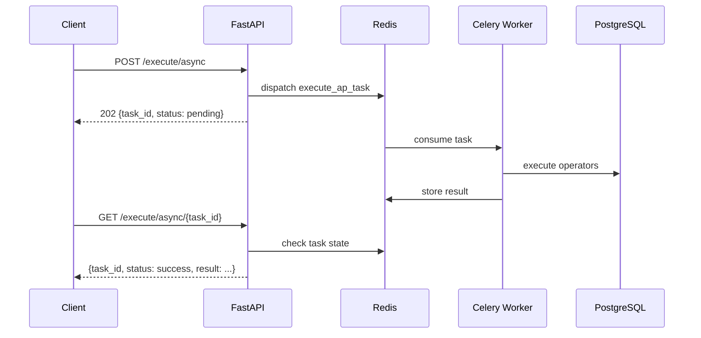

# Service Architecture

The AP Executor service is a RESTful API designed to execute the operators defined in Analytical Patterns against PostgreSQL databases. This document outlines the key components and their interactions.

## High-Level Architecture

```
┌─────────────────────────────────────────┐
│       FastAPI REST API Layer            │
│  /execute  |  /execute/async            │
└─────────────────┬───────────────────────┘
                  │
┌─────────────────▼───────────────────────┐
│      Executor Service (Business Logic)  │
│  Resolves operator order & dispatches   │
└─────────────────┬───────────────────────┘
                  │
┌─────────────────▼───────────────────────┐
│   Dynamic DB Connection (DI Layer)      │
│   Primary PG ──▶ Timescale fallback     │
└─────────────────┬───────────────────────┘
                  │
┌─────────────────▼───────────────────────┐
│         PostgreSQL Database(s)          │
└─────────────────────────────────────────┘
```

## Sync vs Async Execution

### Synchronous (`POST /execute`)

The API receives the AP, parses it, resolves operator order, executes each operator against the database, and returns the full `ExecutionResult` inline.

### Asynchronous (`POST /execute/async`)

The API dispatches the execution to a **Celery worker** via Redis and returns a `task_id` (HTTP 202). The client can then poll `GET /execute/async/{task_id}` to retrieve the result.



## Database Requirements

- **PostgreSQL**: The target databases must be accessible via the credentials in environment variables.
- **Dual Database Architecture**: The service supports connecting to databases across two PostgreSQL instances:
  - **Primary PostgreSQL**: Configured via `POSTGRES_HOST` and `POSTGRES_PORT`
  - **Timescale Fallback**: Configured via `POSTGRES_TIMESCALE_HOST` and `POSTGRES_TIMESCALE_PORT`
- **Dynamic Connection Management**: Connection pools are created per-AP execution and cleaned up after completion.

## Key Design Patterns

### Operator Execution Order

The executor resolves a topological order from the AP graph:
1. Operator nodes connected by `follows` edges are ordered so predecessors run first (Kahn's algorithm).
2. Operators without ordering constraints are appended in node-list order.
3. Non-executable operators (e.g. placeholders) are skipped gracefully.

### Dependency Injection

The DI layer (`di.py`) manages:
- **Dynamic DB connections**: Connection pools created per-AP execution, cleaned up after completion.
- **Database routing**: Automatic fallback from primary PostgreSQL to Timescale.
- **Celery worker lifecycle**: Optionally embedded in the FastAPI process.
