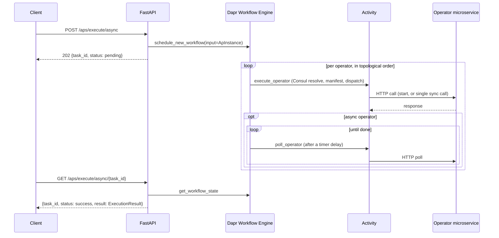

# Service Architecture

The AP Executor service is a RESTful API that orchestrates execution of the operators defined in Analytical Patterns. Each operator is an independently-deployed microservice, discovered via Consul and invoked over HTTP; orchestration itself is handled by Dapr Workflow. This document outlines the key components and their interactions.

## High-Level Architecture

```
FastAPI route (api/v1/analytical_patterns/{exec_sync,exec_async}.py)
      │  schedules / polls, passing an ApInstance straight in as workflow input
      ▼
Dapr Workflow orchestrator (workflows/ap_execution.py :: ap_execution_workflow)
      │  must stay deterministic / I/O-free — walks the graph itself and yields
      │  one ctx.call_activity per operator
      ├─ instance.iter_operators() – topological order (domain/ap_instance.py)
      └─ instance.resolve_operator_input_values(op_id) – merges caller
         parameters with upstream-mapped values (domain/ap_instance.py)
      ▼
Dapr activities (workflows/operator_execution.py :: execute_operator_activity / poll_operator_activity)
      │  ALL I/O happens here
      ├─ OperatorResolver.resolve() (services/operator_resolver/operator_resolver.py)
      │    ├─ Consul lookup (services/operator_resolver/registry/consul_registry.py)
      │    └─ manifest fetch (services/operator_resolver/manifest/http_manifest_retriever.py
      │                        → GET /.well-known/operator.yaml)
      └─ dispatch via OperatorExecutionStrategy (services/executor/strategies/{http_sync,http_async_polling}.py,
                                                   selected by strategies/factory.py::ExecutionStrategyFactory.create)
      ▼
Externally-deployed operator microservice (HTTP)
```

The orchestrator function (`ap_execution_workflow`) must never perform I/O directly — Dapr replays it on every history event, so any direct I/O would break determinism. It only walks the graph (via `ApInstance.iter_operators()`) and yields activity calls; there is no separate "executor" class — the walk lives directly in the generator.

Its input is the `ApInstance` itself (`domain/ap_instance.py`) — the route handlers (`exec_sync.py` / `exec_async.py`) schedule the workflow with `input=instance` directly, no wrapper model. `dapr-ext-workflow` reconstructs the `ApInstance` (and its nested `moma_management` models) on the worker side via Pydantic's model protocol — see the [dapr-ext-workflow alias round-trip](#dapr-ext-workflow-alias-round-trip) note below for a related gotcha.

## Sync vs Async Execution

### Synchronous (`POST /aps/execute`)

The API schedules a Dapr workflow instance and blocks on `wait_for_workflow_completion` for up to `SYNC_EXECUTION_TIMEOUT_SECONDS`. If the workflow hasn't finished by then, the request returns **504** with a message pointing the caller at `GET /aps/execute/async/{instance_id}` instead. On completion, the full `ExecutionResult` is returned inline; a failed workflow returns **500** with the failure detail.

### Asynchronous (`POST /aps/execute/async`)

The API schedules the same workflow and immediately returns **202** with the workflow's `instance_id` as `task_id`. The client polls `GET /aps/execute/async/{task_id}`, which maps the Dapr `WorkflowStatus` to a simpler vocabulary:

| `WorkflowStatus` | Reported status |
|---|---|
| `PENDING` | `pending` |
| `RUNNING` | `running` |
| `COMPLETED` | `success` |
| `FAILED` / `TERMINATED` | `error` |
| `SUSPENDED` | `suspended` |
| `STALLED` | `stalled` |
| `UNKNOWN` | `unknown` |
| *(no workflow found)* | `not_found` |


```mermaid
sequenceDiagram
    participant Client
    participant API as FastAPI
    participant WF as Dapr Workflow Engine
    participant Activity as Activity
    participant Operator as Operator microservice

    Client->>API: POST /aps/execute/async
    API->>WF: schedule_new_workflow(input=ApInstance)
    API-->>Client: 202 {task_id, status: pending}

    loop per operator, in topological order
        WF->>Activity: execute_operator (Consul resolve, manifest, dispatch)
        Activity->>Operator: HTTP call (start, or single sync call)
        Operator-->>Activity: response
        opt async operator
            loop until done
                WF->>Activity: poll_operator (after a timer delay)
                Activity->>Operator: HTTP poll
            end
        end
    end

    Client->>API: GET /aps/execute/async/{task_id}
    API->>WF: get_workflow_state
    API-->>Client: {task_id, status: success, result: ExecutionResult}
```

## Operator Contract

Every operator implementation exposes a manifest at `/.well-known/operator.yaml` (`services/operator_resolver/manifest/manifest.py::OperatorManifest`) declaring its name, version, typed inputs/outputs, and its execution mode:

- **`sync`** (`OperatorExecutionSyncSpec`) — a single `endpoint` that runs the operator and returns its result immediately. Handled by `HttpSyncExecutionStrategy`.
- **`async`** (`OperatorExecutionAsyncSpec`) — a `start_endpoint` that kicks off a job and a `poll_endpoint` (templated with the job id) to check on it. Handled by `HttpAsyncPollingExecutionStrategy`, which the orchestrator polls on a timer (`workflows/ap_execution.py`'s `POLL_INTERVAL`) rather than blocking a single activity call for the operator's whole duration.

See [Registering an Operator](operators.md) for the full manifest schema, Consul registration requirements, and worked examples.

## Key Design Patterns

### Operator Execution Order & Dataflow

`ApInstance` (`domain/ap_instance.py`) owns both graph concerns:

1. `iter_operators()` — topological order over `Operator`-labeled nodes, using Kahn's algorithm on `follows` edges (predecessors run first). Operators without ordering constraints are appended in node-list order.
2. `resolve_operator_input_values(operator_id)` — merges an operator's caller-supplied parameters (`state[operator_id]`) with any values wired in from upstream operators via `input`-labeled edges (whose `properties.mapping` may hop through an intermediate `ResultType` node reached by an `output`-labeled edge). Upstream-mapped values override same-named caller parameters.

The orchestrator calls `resolve_operator_input_values` right before dispatching each operator, and writes each operator's output back into `instance.state[operator_id]` once it completes, so it's visible to any downstream operator resolved afterwards in the same run.

### Dependency Injection

`ap_executor/di.py` is a FastAPI `lifespan` context manager: it starts the Dapr `WorkflowRuntime` (which registers the AP execution workflow and its activities, then connects to the local Dapr sidecar), and exposes a shared `DaprWorkflowClient` via `app.state`, injected into route handlers through `Depends(get_workflow_client)`.

It also exposes `get_operator_resolver()`, a FastAPI dependency for the shared `OperatorResolver`. Its actual construction logic (`OperatorResolver` + `ConsulRegistryClient` + `HttpManifestRetriever`) lives in `services/operator_resolver/factory.py::default_operator_resolver`, not in `di.py` itself — `di.py` imports `ap_executor.workflows` at module scope to register the workflow, and importing any submodule of `ap_executor.workflows` always runs that package's `__init__.py` first, which imports `ap_execution.py` → `operator_execution.py`. That makes `di.py` transitively depend on `operator_execution.py`, so `operator_execution.py` can never import back from `di.py` without a cycle. `default_operator_resolver` is the one shared implementation; both `di.get_operator_resolver` (for FastAPI routes) and `operator_execution.py`'s `operator_resolver_factory` default depend on it directly, instead of one depending on the other.

### dapr-ext-workflow alias round-trip

`dapr-ext-workflow` (`workflows/runtime.py`) auto-coerces Pydantic model workflow inputs/outputs, but its internal helpers are asymmetric: it serializes with `model_dump(mode="json")` (field names) and deserializes with `model_validate(value)` (aliases only). That breaks for any model with `Field(alias=...)` whose alias differs from its field name — e.g. `moma_management`'s `Edge.from_` (aliased to `"from"`, since `from` is a Python keyword). `workflows/runtime.py` patches the dump side to serialize `by_alias=True` so it matches what validation expects. This is a monkeypatch of a private `dapr.ext.workflow._model_protocol` function — if a `dapr-ext-workflow` upgrade changes that module, re-check this patch still applies.
